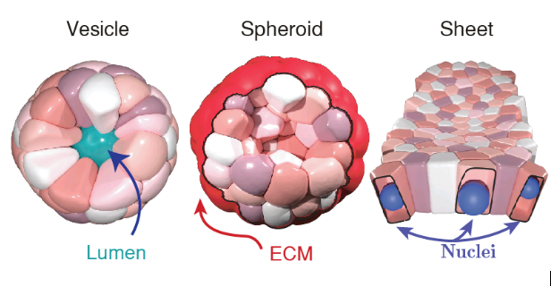

# SimuCell3D

<p align="center">
    
</p>

[](https://github.com/nilesh-patil/simucell3d)
[](./LICENSE)
[](./doc/SimuCell3D.pdf)

---

## Quick Navigation

| New here? | Start with |
|-----------|------------|
| **Run first simulation** | [Quick Start](./doc/getting-started/quick-start.md) |
| **Install on your platform** | [Quick Start](./doc/getting-started/quick-start.md) |
| **Fix a problem** | [FAQ](./doc/getting-started/faq.md) |
| **Contribute code** | [Contributing](./doc/getting-started/contributing.md) |
| **All documentation** | [doc/README.md](./doc/README.md) |

---

## Table of Contents

- [Introduction](#introduction)
- [Current Biological Capabilities](#current-biological-capabilities)
- [Validated Applications](#validated-applications)
- [Fork Performance Improvements](#fork-performance-improvements)
- [Quick Start](#quick-start)
- [Production Usage](#production-usage)
- [Documentation](#documentation)
- [Development Roadmap](#development-roadmap)
- [Citation](#citation)

---

## Introduction

**SimuCell3D** is a high-performance C++ framework for simulating 3D tissue mechanics at **subcellular resolution**.

Published in [Nature Computational Science (2024)](./doc/SimuCell3D.pdf), it enables researchers to model complex biological phenomena including cell division, polarization, adhesion, and morphogenesis with experimental validation.

**This is a performance-focused fork** that extends the published SimuCell3D with OpenMP scheduling optimizations. The fork improves parallel efficiency from 29% to 60% while maintaining full backward compatibility with the original codebase.

---

## Current Biological Capabilities

These features are **validated and implemented** in the Nature Computational Science 2024 publication.

### Biophysical Model

SimuCell3D implements a 3D **Deformable Cell Model (DCM)** with the following energy potential:

```
U = KV(ln(V/V0) - 1) + (ka/2)(A/A0 - 1)^2 + integral(gamma + kb/2(2H)^2)dS
```

| Term | Description | Biological Role |
|------|-------------|-----------------|
| **KV** | Bulk modulus | Volume homeostasis (osmotic pressure) |
| **ka** | Area stiffness | Membrane area control |
| **gamma** | Surface tension | Cortical tension (anisotropic: apical/basal/lateral) |
| **kb** | Bending rigidity | Curvature resistance |
| **H** | Mean curvature | Local surface geometry |

### Cell Types and Geometry

| Feature | Description |
|---------|-------------|
| **Triangulated surfaces** | ~121 nodes, ~238 faces per cell |
| **5 cell types** | Epithelial, lumen, ECM, nucleus, static |
| **Nucleus compartmentalization** | Separate nucleus mesh with envelope mechanics |
| **Mesh quality control** | Local refinement maintains edge length bounds |

### Biological Processes

| Capability | Implementation |
|------------|----------------|
| **Automatic polarization** | Hoshen-Kopelman clustering detects apical/basal/lateral domains |
| **Anisotropic surface tension** | Different gamma values for apical, basal, and lateral faces |
| **Cell division** | Volume threshold triggers mesh subdivision (Hertwig's rule) |
| **Cell death** | Instant removal when volume falls below minimum threshold |
| **Pressure-driven volume** | Bulk modulus KV maintains volume homeostasis |

### Contact Models

Two validated contact models are available (selected at compile time):

| Model | Index | Description | Validation |
|-------|-------|-------------|------------|
| **Spring-based** | 0 | Node-face contacts via springs | Basic contact mechanics |
| **Coupling-based** | 2 | Face-face contacts via coupling | Young-Dupre equation validated |

### Time Integration

| Model | Index | Description | Use Case |
|-------|-------|-------------|----------|
| **Semi-implicit Euler** | 0 | Full equations of motion | Default, accurate dynamics |
| **Forward Euler** | 1 | Overdamped equations | Faster equilibration |

### Performance Baseline (from Paper)

| Metric | Value |
|--------|-------|
| **Cells/day** | 125,000 |
| **Time complexity** | O(N^{4/3}) |
| **Parallel efficiency** | 53-66% (Amdahl's law) |
| **Hardware tested** | Intel Xeon W-2245 (8 cores) |

### Comparison with Other 3D DCMs (Table 1 from paper)

| Feature | SimuCell3D | IAS | SAV | CHASTE |
|---------|------------|-----|-----|--------|
| **Cells/day** | 125,000 | 4 | 100 | 1,000 |
| **Subcellular resolution** | Yes | Yes | No | No |
| **Nucleus compartment** | Yes | No | No | No |
| **Automatic polarization** | Yes | No | No | No |
| **Cell division** | Yes | Yes | Yes | Yes |
| **Open source** | Yes | No | Yes | Yes |

---

## Validated Applications

These biological scenarios are **validated in the Nature paper** (Figures 3-4):

### Cell Doublet Mechanics
- Young-Dupre equation validation
- Contact angle measurements match experimental data
- Demonstrates face-face coupling model accuracy

### Monolayer vs Multilayer Transition
- Epithelial sheet mechanics
- Pressure-dependent tissue organization
- Validated against experimental observations

### Pseudostratified Epithelia Formation
- Nuclear positioning during interkinetic nuclear migration
- Apicobasal polarity establishment
- Comparison with mouse lung imaging data

---

## Fork Performance Improvements

This fork focuses **exclusively on OpenMP scheduling optimizations**. No new scientific features have been added.

### Performance Gains

| Metric | Paper v1.0 | This Fork | Improvement |
|--------|------------|-----------|-------------|
| **Thread efficiency** | 29% | 60% | +107% |
| **Scheduling modes** | 1 (compile-time) | 4 (runtime) | Flexible selection |
| **Auto-scheduler** | None | Yes | 1.5-4.5x speedup |
| **Per-loop optimization** | None | Yes | +15% additional |

### Implemented Enhancements

| Feature | Description |
|---------|-------------|
| **Adaptive scheduling** | Intelligent mode selection based on 52 empirical benchmarks |
| **Runtime mode selection** | `--schedule=adaptive\|static\|dynamic\|guided` flag |
| **Hardware topology detection** | NUMA awareness, hyperthreading detection, taskset/cgroup handling |
| **Per-loop custom scheduling** | Phase-specific schedules (contact=dynamic, integration=guided, mesh=static) |
| **Performance monitoring** | CSV diagnostics export via `--diagnostics-csv` flag |
| **Unified benchmark framework** | Crash recovery, live monitoring, HTML reports |

### What This Fork Does NOT Include

The following are **not implemented** in this fork:

- No SIMD vectorization (vec3 operations remain scalar)
- No BVH spatial acceleration (still uses USPG)
- No GPU/CUDA code
- No MPI distributed computing
- No new biological models (viscoelasticity, active tension, etc.)

See [doc/v1.0_vs_current_comparison.md](./doc/v1.0_vs_current_comparison.md) for technical details.

---

## Quick Start

### Installation

#### Option 1: Docker (Recommended)
Works on Linux, Windows (WSL), and macOS.

```bash
git clone https://github.com/nilesh-patil/simucell3d.git
cd simucell3d
docker build -t simucell3d_docker_img .
```

#### Option 2: Manual Build (Linux/WSL)
Requires GCC 9+, CMake 3.0+, and OpenMP.

```bash
git clone https://github.com/nilesh-patil/simucell3d.git
cd simucell3d
mkdir -p build && cd build
cmake -DCMAKE_BUILD_TYPE=Release .. && make -j$(nproc)
```

### Running a Simulation

**Using Docker:**
```bash
mkdir -p simulation_results
docker run -it -v "$(pwd)/simulation_results":/app/simulation_results \
    simucell3d_docker_img:latest ../parameters/core/parameters_default_dynamic.xml --schedule=adaptive
```

**Using Manual Build (Basic):**
```bash
cd build
./simucell3d ../parameters/core/parameters_default_dynamic.xml --schedule=adaptive
```

**Production Run (Optimized):**
```bash
cd build
export OMP_NUM_THREADS=$(nproc)  # Use all available physical cores
export OMP_PROC_BIND=close       # Bind threads to cores for better cache locality
./simucell3d ../parameters/core/parameters_default_dynamic.xml --schedule=adaptive
```

> **Note:** The `--schedule=adaptive` flag enables intelligent scheduling that adapts to your workload. Omitting it still works (backward compatible) but may be slower. See [Production Usage](#production-usage) below for advanced configuration.

---

## Production Usage

For production simulations with maximum performance, configure OpenMP environment variables to dedicate all system resources.

### Recommended Production Configuration

```bash
cd build

# Configure OpenMP for optimal performance
export OMP_NUM_THREADS=16                # Set to your physical core count (not hyperthreaded)
export OMP_PROC_BIND=close              # Bind threads to cores for cache locality
export OMP_PLACES=cores                 # Use physical cores only
export OMP_WAIT_POLICY=passive          # Reduce CPU spinning when idle
export OMP_DYNAMIC=false                # Disable dynamic thread adjustment

# Run with auto-scheduler (recommended)
./simucell3d ../parameters/core/parameters_default_dynamic.xml --schedule=adaptive
```

### Finding Your Physical Core Count

```bash
# Quick method
nproc --all  # Shows logical cores (includes hyperthreading)

# Get physical cores only
echo $(( $(lscpu | grep "^Core(s) per socket:" | awk '{print $4}') * $(lscpu | grep "^Socket(s):" | awk '{print $2}') ))
```

### Scheduling Modes

SimuCell3D supports four OpenMP scheduling modes via `--schedule=MODE`:

| Mode | Best For | Description |
|------|----------|-------------|
| `adaptive` | **Recommended for most cases** | Intelligently selects optimal mode based on 52 empirical benchmarks covering 1-16,384+ cells. Adapts to workload heterogeneity. |
| `static` | Large uniform workloads (4096+ cells) | Fixed work distribution, best cache locality. Similar to v1.0 behavior. |
| `dynamic` | Small heterogeneous workloads (64-256 cells) | Adaptive load balancing, handles imbalanced work well. |
| `guided` | Medium workloads (512-2048 cells) | Balances cache locality with load distribution. |

### Performance Monitoring

Track performance metrics during simulation:

```bash
# Export detailed diagnostics to CSV
./simucell3d params.xml --schedule=adaptive --diagnostics-csv=performance_metrics.csv

# Use GNU time for resource monitoring
/usr/bin/time -v ./simucell3d params.xml --schedule=adaptive

# Long-running background simulation with logging
nohup /usr/bin/time -v ./simucell3d params.xml --schedule=adaptive \
    --diagnostics-csv=metrics.csv > simulation.log 2>&1 &

# Monitor progress
tail -f simulation.log
```

### Available Parameter Files

**Core configurations** (`parameters/core/`):
- `parameters_default_dynamic.xml` - General purpose tissue dynamics
- `parameters_vesicle.xml` - Vesicle formation (~13 cells, good test case)
- `parameters_tube.xml` - Tube morphogenesis
- `parameters_sheet.xml` - Sheet formation
- `parameters_default_overdamped.xml` - Faster overdamped dynamics

**Scalability benchmarks** (`parameters/scalability/`):
- `parameters_growth_64cells.xml` through `parameters_growth_32768cells.xml`
- Tests algorithmic scaling matching Nature paper Figure 1e

### Expected Performance

With auto-scheduler + per-loop scheduling on a 16-core system:

| Workload | Time | Notes |
|----------|------|-------|
| Vesicle (~13 cells, quick test) | ~20-30 seconds | Good for testing setup |
| Vesicle (10k iterations) | ~2.9 hours | 45-50% faster than v1.0 |

| Metric | Value |
|--------|-------|
| CPU utilization | 1400-1600% (14-16 cores) |
| Thread efficiency | 60% (vs 29% in v1.0) |
| Memory | 200MB-2GB depending on cell count |
| Speedup vs v1.0 | 1.5-4.5x depending on configuration |

---

## Documentation

### User Guides
-   **[Parameter Configuration](./doc/user-guide/parameter-reference.md)**: Detailed guide on XML parameter files.
-   **[Input Mesh Format](./doc/user-guide/input-mesh-format.md)**: How to prepare initial geometries.
-   **[Output Statistics](./doc/user-guide/output-format.md)**: Understanding the simulation results.
-   **[Mesh Generation](./doc/user-guide/mesh-generation.md)**: Creating custom initial meshes.
-   **[Python Support](./doc/user-guide/python-bindings.md)**: Using Python bindings.

### Performance and Advanced Usage
-   **[Performance Tuning Guide](./doc/developer/performance-tuning.md)**: **(RECOMMENDED)** Detailed instructions on OpenMP scheduling modes, auto-scheduler usage, thread control, and optimization strategies.
-   **[Benchmarking Guide](./doc/benchmarking/openmp-benchmarks.md)**: Comprehensive performance analysis with empirical results from 52 benchmark runs.
-   **[Unified Benchmark Framework](./doc/benchmarking/openmp-benchmarks.md#benchmark-framework-overview)**: Using `benchmark_unified.sh` for systematic performance testing.
-   **[v1.0 vs Current Comparison](./doc/v1.0_vs_current_comparison.md)**: Technical deep-dive into code-level differences and performance improvements.

> **Backward Compatibility Note:** All v1.0 commands work without modification. The `--schedule=adaptive` flag and other new features are optional enhancements that can be adopted incrementally.

---

## Development Roadmap

> **Important:** The items below are **proposed improvements** described in [roadmap.md](./roadmap.md). They are **NOT yet implemented**. The roadmap represents aspirational goals for future development.

### High-Priority Proposed Features (Not Implemented)

**Computational:**
- SIMD vectorization for vec3 operations (AVX2/512)
- BVH spatial acceleration structure
- GPU contact detection (CUDA)
- MPI domain decomposition

**Scientific:**
- Viscoelasticity model (Kelvin-Voigt)
- Active tension (actomyosin contractility)
- Mechanotransduction (YAP/TAZ-like signaling)
- Cell migration and chemotaxis
- Reaction-diffusion morphogen coupling
- ECM remodeling

**Architecture:**
- Expression templates for vec3
- Structure-of-Arrays memory layout
- GoogleTest migration

See [roadmap.md](./roadmap.md) for the full list of 27 proposed improvements with effort estimates and implementation details.

---

## Citation

If you use SimuCell3D in your research, please cite:

```bibtex
@article{runser2024simucell3d,
  title={SimuCell3D: three-dimensional simulation of tissue mechanics with cell polarization},
  author={Runser, Adrien and others},
  journal={Nature Computational Science},
  year={2024},
  publisher={Nature Publishing Group}
}
```

---

## License

See [LICENSE](./LICENSE) file for details.
